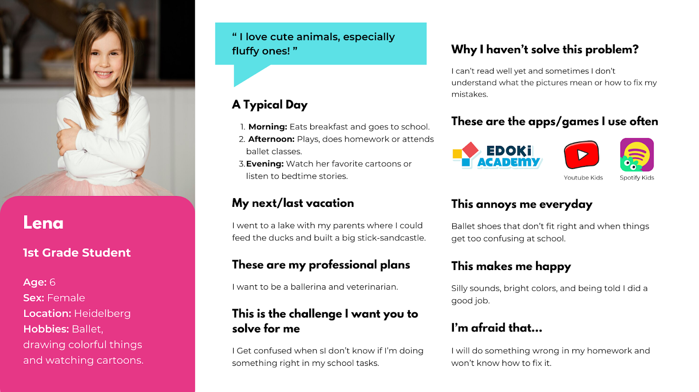
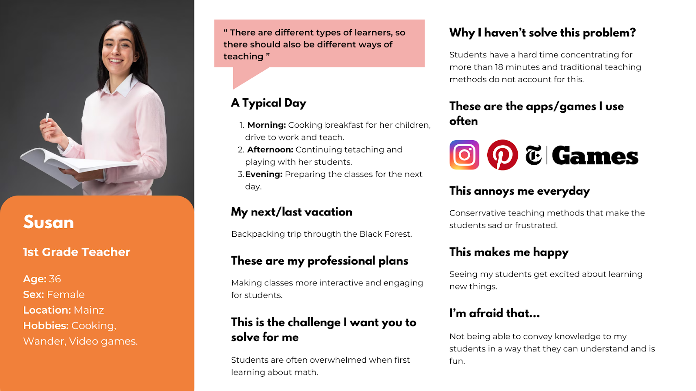
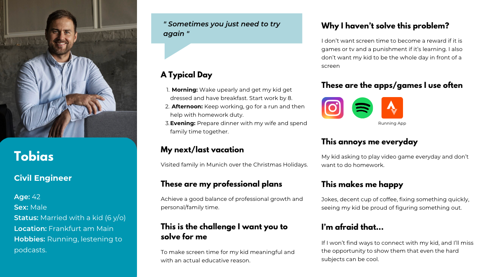
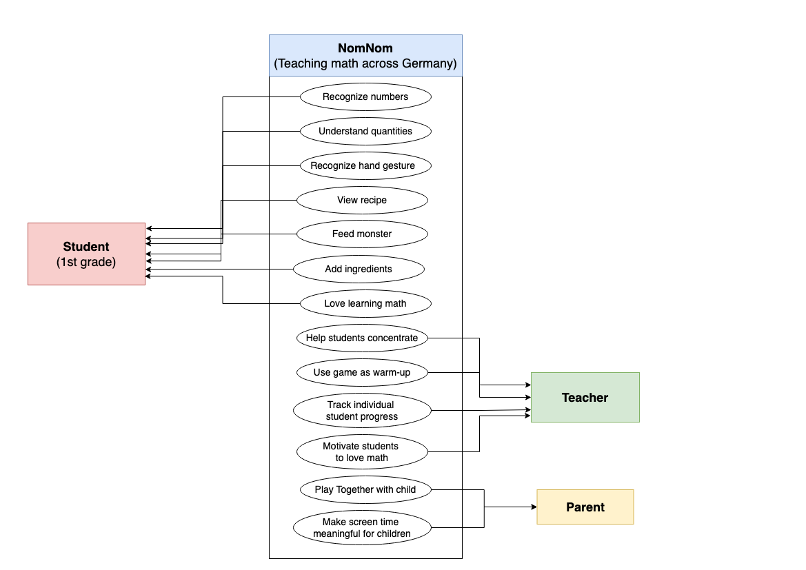
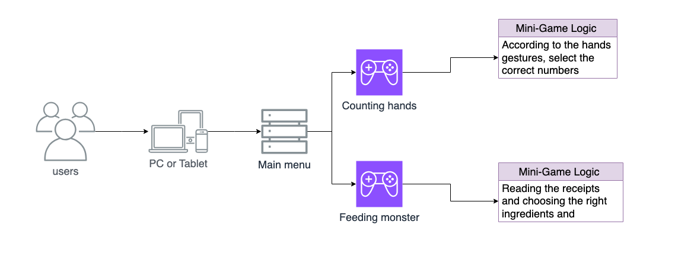
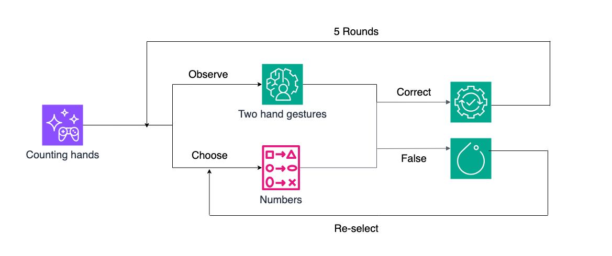
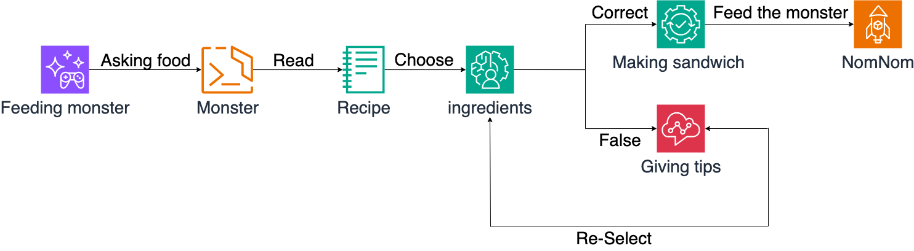
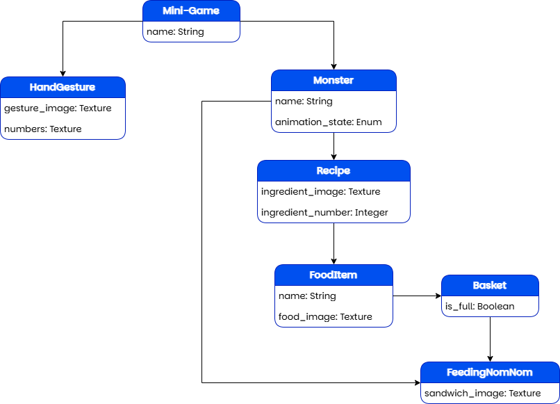
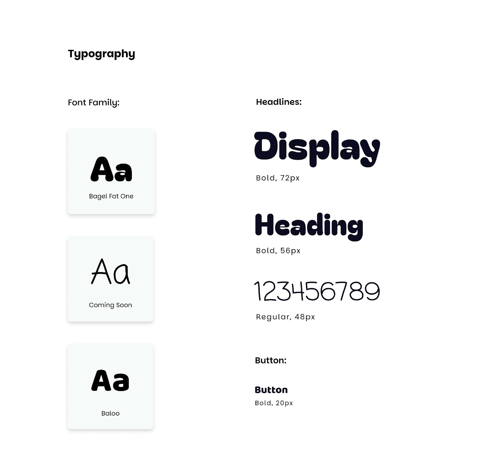
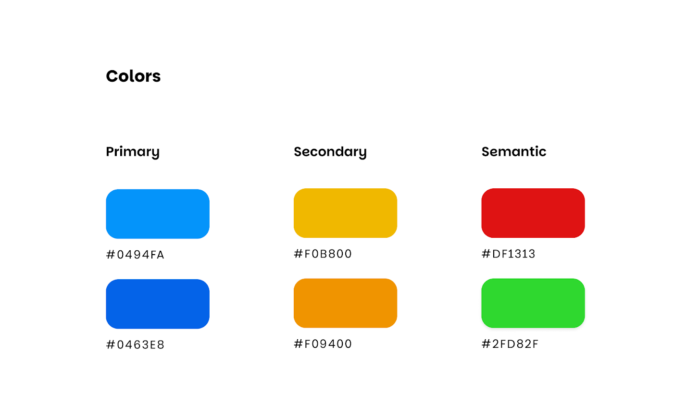

# **Index** 

[1. Introduction](#1-introduction)

- [1.1 Purpose](#11-purpose)

- [1.2 Summary of scope and stakeholders](#12-summary-of-scope-and-stakeholders)

- [1.3 Definitions and Abbreviations](#13-definitions-and-abbreviations)

- [1.4 References, Standards, and Rules](#14-references-standards-and-rules)

- [1.5 Overview](#15-overview)

[2. Requirements documentation](#2-requirements-documentation)

- [2.1 Product vision and product goals](#21-product-vision-and-product-goals)

- [2.2 Personas](#22-personas)

- [2.3 User stories](#23-user-stories)

- [2.4 Use cases](#24-use-cases)

- [2.5 Quantity structure](#25-quantity-structure)

- [2.6 Dictionary/Glossary of terms](#26-dictionaryglossary-of-terms)

[3. Architectural documentation](#3-architectural-documentation)

- [3.1 Description of the system architecture](#31-description-of-the-system-architecture)

- [3.2 System design](#32-system-design)

- [3.3 Human-Machine interface](#33-human-machine-interface)

[4. Test documentation](#4-test-documentation)

- [4.1 Test specification](#41-test-specification)

- [4.2 Test protocol](#42-test-protocol)

[5. Acceptance documentation](#5-acceptance-documentation)

- [5.1 System Under Test (SUT)](#51-system-under-test-sut)

- [5.2 Provision for acceptance (BZA)](#52-provision-for-acceptance-bza)

- [5.3 Submission of acceptance report incl. agreed use cases](#53-submission-of-acceptance-report-incl-agreed-use-cases)

[6. User documentation](#6-user-documentation)

[7. Project documentation](#7-project-documentation)

- [7.1 Project approach](#71-project-approach)

- [7.2 Lessons Learned](#72-lessons-learned)

[8. Mapping of individual performance](#8-mapping-of-individual-performance)

# 1. Introduction

## 1.1 Purpose

This document was created by the development team of the educational game “NomNom”, intended to assist in structuring and documenting the requirements, architecture, design, and testing of the project. 

The document should be read by:

* The team  
* Teachers reviewing the educational value  
* Testers and UX designers are involved in user feedback and improvements  
* Any stakeholders, such as project supervisors, academic reviewers, or sponsors.

This document is binding for:

* The development team ensures implementation follows the planned structure and requirements  
* Test participants and evaluators

## **1.2 Summary of scope and stakeholders**

“NomNom” is a visual-based educational game designed for 1st-grade students to learn basic math through interaction and positive reinforcement. The game will feature two mini-games focused on:

* Counting using hand gestures  
* Feeding a monster using quantities of ingredients in recipes

The game avoids text where possible, relying on visual and audio feedback to guide and reward the user. It is aimed at children who are still learning to read, with content tailored to their cognitive level.

The stakeholders of this project include:

* **Game Designers**: responsible for the core design.  
* **Developers**: implement the mini-games.  
* **Educational Experts**: ensure the effectiveness of the game.  
* **Parents and Teachers**: help children engage with the game.  
* **Students (Players)**: primary end users.

## **1.3 Definitions and Abbreviations**

* **2D Image**: A graphical, static image file used to represent visual elements in the game, such as the monster, the recipe book, UI buttons, backgrounds, etc.  
* **Animation**: A visual sequence of images to display movements or effects, such as the monster eating.  
* **Asset**: A resource used in the game’s development. This includes 2D images, sounds, 2D sprites, videos, and scripts.  
* **Background**: A static 2D image used as the backdrop of a particular scene.  
* **Food**: An object composed of ingredients and prepared and given to the monster by the player.  
* **Game Object**: A functional element in the game with a certain objective or purpose, such as ingredients or backgrounds.  
* **Hand-Gestures Scene**: A scene where the player selects a number based on the hand-gestures images displayed.  
* **Incentive**: Feedback mechanism represented by 2D images and sounds to indicate a successful action.  
* **Ingredient**: A clickable item represented by a 2D image, used by the player to fulfill the requirements to prepare a food item.  
* **Kitchen Scene**: A scene where the player selects ingredients to prepare food for the monster.  
* **Main Scene**: The Principal scene where primary interactions occur, such as selecting a mini-game.  
* **Mini-game**: Individual games focused on specific tasks or learning objectives to be performed by the player, such as feeding the monster.  
* **Monster**: A non-playable character to be fed with certain food. Its hunger relies on the player's success.  
* **Non-Playable Character**: A character in the game not controlled by the player.  
* **NomNom**: The Name that is given to the monster character.   
* **Picnic Scene**: A scene where the monster requests food and is fed by the player.  
* **Player**: A 1st grade student who interacts with the game by relating hand gestures to number symbols or selecting ingredients, and feeding the monster.  
* **Recipe Book**: A UI element showing the required ingredients needed to prepare a food object.  
* **Scene**: A game view which contains certain game objects for a certain part of the game (e.g., Picnic Scene or Kitchen Scene).  
* **Script**: A file containing code that defines the behaviour of game objects.  
* **Tutorial Video**: A short, instructional video is displayed before a mini-game to demonstrate how to play.  
* **UI (User Interface)**: Collection of visual and interactive elements that allow the player to navigate through the game and perform certain actions, such as closing a window, displaying the Recipe Book, or starting a mini-game. This includes buttons, icons, menus, and screens.

## **1.4 References, Standards, and Rules**  

#### **1\. Referenced Concepts and Standards**

* Early childhood education guidelines for numeracy in 1st-grade  
* Usability heuristics for children’s educational software  
* Design principles for non-reading age group interfaces

#### **2\. External Inspiration**

* Endless Numbers (Originator Inc.)  
* Monkey Math School Sunshine (Thup Games)  
* Toca Boca series (i.e., Toca Kitchen)

#### **3\. Rules**

* Minimize text; use symbols and audio for communication  
* Provide positive feedback through sounds and animations  
* Keep interaction time short per mini-game round

## **1.5 Overview**

This report provides an in-depth description of the project created by the team for the Foundations of Software Engineering course, including planning, design, development, and testing. It begins with introductory drivers, including purpose, scope, primary stakeholders, and definitions, and then describes the product vision, needs, and user-driven strategy through personas, user stories, and use cases.

Technical aspects such as the system architecture, design specifications, interface design, and test procedures are then covered. Acceptance process and documentation have also been included to ensure project validation. Finally, user and project documentation highlight implementation strategy, learning, and personal contributions.

# **2\. Requirements documentation**

## **2.1 Product vision and product goals**

### **Product Vision**

* Teaching 1st grade students across Germany basic math through fun mini-games: recognizing numbers, understanding quantities, and comparing numbers.  
* In the future, we want to expand the game to be compatible with higher-grade students, such as adding numbers.

### **Product Goals**

Develop within 4 months an application/game that helps as a practical tool for teachers to teach 1st grade students from Germany foundational math skills, including number recognition (with numbers from 1–10) and quantity understanding, through a series of engaging and fun, curriculum-aligned mini-games, with the aim of achieving at least 80% of students correctly completing these tasks in the game environment during the test phase.

## **2.2 Personas**

### **Children** 

 
 

### **Teacher**

 

### **Parent**

 

## **2.3 User stories**

1. As a student, I want to watch a tutorial before starting a mini-game, so I can understand how to play.   
2. As a student, I want incorrect number choices to turn red and stay that way, so I can remember which ones I already tried.   
3. As a student, I want the correct number to turn green when I select it, so I know I got the right answer.   
4. As a student, I want to see a celebration animation after completing 5  consecutive correct rounds, so I feel rewarded.  
5. As a student, I want to see a list of ingredients needed for the sandwich recipe so I know what to collect.  
6. As a student, I want to drag ingredients from the kitchen table so I can add them to my basket.  
7. As a student, I want to see how many ingredients are still needed so I know when I’ve completed the recipe and can stop collecting them.  
8. As a student, I want to be reminded when I’ve already collected enough of an ingredient so I don’t keep picking more by mistake.  
9. As a student, I want to hear sound effects when I put ingredients into the basket to make it more engaging.  
10. As a student, I want the game to let me know when my basket is complete, so I know I’ve finished collecting all the ingredients.  
11. As a student, I want to drag the sandwich to NomNom’s mouth when it’s complete so I can feed him.  
12. As a student, I want to see NomNom happy when I feed him.  
13. As a student, I want to see a celebration (confetti, stars) when I complete a recipe correctly to feel rewarded.  
14. As a student, I want to get a new recipe after feeding NomNom so I can play again.  
15. As a teacher, I want the game to work smoothly, so my students can focus on learning instead of worrying about why the game doesn’t work.   
16. As a teacher, I want the game to be simple to set up, so I can quickly let students play during a math lesson.  
17. As a teacher, I want to use the game as a warm-up or reward in class so I can engage students in a fun way.  
18. As a parent, I want to be able to take screenshots of what my child is doing with the game sessions so I can stay informed.  
19. As a parent, I want the game to be safe, so I can let my child play without worry.  
20. As a parent, I want to guide my child through the mini-game by watching the instructions together, so I can help them learn in the right way.  
21. As a student, I want to be able to select the mini-game that I want to play, because I need to do more sessions for a specific one. 

## **2.4 Use cases**

### **Use Case Diagrams**

 

### **Use Cases**

| Field | Description |
| :---- | :---- |
| **Actor** | 1st grade student |
| **Goal** | Counting Hands: Counting numbers with hands and fingers. Feeding the Monster: Feeding NomNom with a sandwich prepared by the player. |
| **Preconditions** | Counting Hands: The player counts the right number of fingers. Feeding the Monster: Collects the required ingredients to prepare the sandwich. |
| **Postconditions** | Counting Hands: The celebratory sound and animation are displayed after 5 consecutive correct rounds. Feeding the monster: The monster reacts happily when it’s fed. |
| **Main Flow** | **Counting Hands:** The student counts the fingers on both hands. The students select the right number. The celebratory sound display. **Feeding the monster:** The student reads the recipe. The student selects ingredients. The student drags the sandwich to the monster. The Monster eats the sandwich. The Monster is happy. |
| **Extensions** | Counting Hands: If the student selects the wrong numbers, the student needs to choose again. Feeding the Monster: If the student tries to add more ingredients than required, there will be a warning sign. |

## **2.5 Quantity structure**

### **Problem Size & Scope**

* Target Age Group: 6–7 years (1st Grade)  
* Number Range (Core Gameplay)  
  * Lower limit: 1, Upper limit: 9

### **Quantitative Parameters**

* Number of Tasks / Per Session  
  * Lower limit: 3, Upper limit: 5  
* Item Quantity Per Task	  
  * Lower limit: 1 item, Upper limit: 10 items  
* Input Attempts Per Task	  
  * Lower limit: 1, Upper limit: 3  
* Visual Representations  
  * Finger count, food icons, monster icons  
  * Max Simultaneous Visual Objects	  
  * Typical value: 6–12 items per task.

### **Rate of Change**

* State Transitions (Monster States)	  
  * Idle → Hungry → Eating → Happy  
  * Game Session Length	  
  * Typical: 5–10 minutes  
* Number of Tasks per Minute  
  * Typical: 1–2 (based on player speed and engagement).

## **2.6 Dictionary/Glossary of terms**

* **2D Image**: A graphical, static image file used to represent visual elements in the game, such as the monster, the recipe book, UI buttons, backgrounds, etc.  
* **Animation**: A visual sequence of images to display movements or effects, such as the monster eating.                                   
* **Asset**: A resource used in the game’s development. This includes 2D images, sounds, 2D sprites, videos, and scripts.  
* **Background**: A static 2D image used as the backdrop of a particular scene.  
* **Food**: An object composed of ingredients and prepared and given to the monster by the player.  
* **Game Object**: A functional element in the game with a certain objective or purpose, such as ingredients or backgrounds.  
* **Hand-Gestures Scene**: A scene where the player selects a number based on the hand-gestures images displayed.  
* **Incentive**: Feedback mechanism represented by 2D images and sounds to indicate a successful action.  
* **Ingredient**: A clickable item represented by a 2D image, used by the player to fulfill the requirements to prepare a food item.  
* **Kitchen Scene**: A scene where the player selects ingredients to prepare food for the monster.  
* **Main Scene**: The Principal scene where primary interactions occur, such as selecting a mini-game.  
* **Mini-game**: Individual games focused on specific tasks or learning objectives to be performed by the player, such as feeding the monster.  
* **Monster**: A non-playable character to be fed with certain food. Its hunger relies on the player's success.  
* **Non-Playable Character**: A character in the game not controlled by the player.  
* **Picnic Scene**: A scene where the monster requests food and is fed by the player.  
* **Player**: A 1st grade student who interacts with the game by relating hand gestures to number symbols or selecting ingredients, and feeding the monster.  
* **Recipe Book**: A UI element showing the required ingredients needed to prepare a food object.  
* **Scene**: A game view that contains certain game objects for a certain part of the game (e.g., Picnic Scene or Kitchen Scene).  
* **Script**: A file containing code that defines the behaviour of game objects.  
* **Tutorial Video**: A short, instructional video is displayed before a mini-game to demonstrate how to play.  
* **UI (User Interface)**: Collection of visual and interactive elements that allow the player to navigate through the game and perform certain actions, such as closing a window, displaying the Recipe Book, or starting a mini-game. This includes buttons, icons, menus, and screens.

# **3\. Architectural documentation**

## **3.1 Description of the system architecture**

### **Functional requirements** 

1. The game must allow the player to choose between two mini-games.  
2. In the hand gesture mini-game, the game must display two hand-gesture images that represent a number and provide clickable buttons labeled from 1 to 10\.  
3. When the player selects a number, the game shall provide immediate feedback through different visuals and sound effects.  
4. In the Feeding the Monster mini-game, the game will begin with the monster requesting a meal through visuals.  
5. After the request, a visual recipe book shall appear showing the necessary ingredients and quantities of each.  
6. The game shall then transition to a kitchen table where the player is able to click on ingredients to add them to a basket.  
7. Once the correct number of ingredients has been added to the basket, the player should be able to feed the monster with the created meal and complete the game.  
8. Throughout the game, feedback will be given visually or auditorily with minimal to no text.

###  **Non-functional requirements** 

1. **Frontend (Game Interface):**  
   The game is developed using Godot and runs locally on a tablet or computer. It contains all visual and interactive elements: animations, game logic, sound effects, and UI. It is the only system component the child interacts with.  
2. **Progress Tracking (Manual, Parent-Assisted):**  
   There is no in-app data tracking. Instead, the game is designed for parent-child co-play. Parents are asked to take screenshots and time logs of gameplay sessions to document how much time was spent and how the child performed. These screenshots are later shared with the teacher as a form of progress reporting.

### **Prioritization of non-functional requirements** 

| Category | Requirement	 | Priority | Measurement criteria | Impact |
| :---- | :---- | :---- | :---- | :---- |
| **Usability** | Play by the 1st-grade student. | High | 80% of students can complete and play the game. | Using video tutorials to show how to play. |
| **Performance** | Run on computers and tablets. | Medium | Run on entry-level devices. | This game needs to be played with parents. |
| **Security** | No data collected from users. | High | No personal data requested. | No backend. |
| **Reliability** | Run without bugs. | High | The game runs two mini-games without bugs. | Use stable Godot engine features only. |
| **Compliance** | Comply with German education levels. | High | Aligned with 1st grade topics. | No data tracking. |
| **Maintainability** | The game is easy to expand with more mini-games. | Medium | Developers can add new scenes without changing or rewriting the code. | Modular scene structure in Godot.  |

### **Architectural principles** 

The architecture of NomNom games was guided and inspired by key non-functional requirements such as usability for young players, good performance on most devices, and maintainability for future development. Based on these, we determined the following architectural principles: 

1. #### **Simplicity**

* To support usability, considering our target group is 1st-grade students, we designed the architecture to be simple and easy to navigate, avoiding the usage of text, only when it is imperatively necessary.   
* Both game’s scenes and logic are straightforward, avoiding misconceptions or high levels of abstraction.  
* A tutorial video for each mini-game explains how to play, and the user interface uses large and easily recognizable icons and animations.

2. #### **Modularity**

* To fulfill the maintainability goal, we structured the game using modular principles.  
* Each mini-game, menu, and its components are implemented as an independent Godot scene. This allows easy implementation of new content without rewriting other parts of the code. 

3. #### **Performance Efficiency**

* To achieve a low-resource demanding game, in order to run on most computers and/or tablets, we use:  
	* Optimized sprites and audio assets.  
	* Godot’s built-in features and functions, such as AudioStreamPlayer, 2DAnimatedSprite, instead of using custom, heavy-performance logic.  

4. #### **Security by Design**   

* No personal data was collected.  
* There is no backend, no login system, and no data storage, ensuring the privacy of children’s experience. 

### **Interfaces** 

Interfaces can be understood as the communication paths between objects or components. In our game, there are several moments when these interfaces are required to ensure the interaction and connection between different parts of the game. 

Using Godot, these interfaces are implemented through code, such as signals or method calls. The following tables demonstrate the usage of interfaces in the game, divided by scenes: 

1. #### **Main Menu Scene**

| Component | When It’s Used | How It’s Used | Why It’s Needed |
| ----- | ----- | ----- | ----- |
| Button: play | When the player selects the play button. | When the button is clicked,  change\_scene\_to\_file(...)is called, and it loads the next scene.  | To load the mini-game selection scene. |
| Button: quit | When the player presses the Quit button. | When the button is clicked, quit() is called, and it closes the game. | To close the game completely. |

2. #### **Mini Game Selection Scene**

| Component | When It’s Used | How It’s Used | Why It’s Needed |
| ----- | ----- | ----- | ----- |
| Button: Hand\_gesture | When the player selects the “Counting Hands” game. | When the button is clicked,  change\_scene\_to\_file(...)is called, and it loads the next scene.  | To load the hand gesture mini-game. |
| Button: Tutorial\_Hand\_Gesture | When the player clicks on the tutorial for the “Counting Hands” game. | When the button is clicked, the tutorial video will be streamed and played calling $Video.stream and $Video.play() | To load the corresponding video and play it |
| Button: Nom\_nom | When the player selects the “Feeding the Monster” game. | When the button is clicked,  change\_scene\_to\_file(...)is called, and it loads the next scene. | To load the NomNom (asking-for-food) scene. |
| Button: Tutorial\_Nom\_nom | When the player clicks on the tutorial for the “Feeding the Monster” game. | When the button is clicked, the tutorial video will be streamed and played calling $Video.stream and $Video.play() | To load the corresponding video and play it |
| Button: Quit | When the player presses the Quit button. | When the button is clicked, quit() is called and it exits the selection menu. | To exit and go to the main menu. |
| Button: Close\_tutorial | When the player presses the close button. | After the video is played, this button will appear and give the user the option to close the tutorial whenever they want. | To close the tutorial and go back to the “Select Game” scene. |

3. #### **Hand Gesture Scene**

| Component | When It’s Used | How It’s Used | Why It’s Needed |
| ----- | ----- | ----- | ----- |
| Button: number | When a number option is clicked. | Compare the clicked number with the right answer. | To compare and give feedback based on the answer of the user.  |

4. #### **Asking For Food Scene**

| Component | When It’s Used | How It’s Used | Why It’s Needed |
| ----- | ----- | ----- | ----- |
| Button: NextButton | When the player clicks the “Next” button after the monster finishes talking. | When the button is clicked,  change\_scene\_to\_file(...)is called, and it loads the next scene. | To load the menu scene. |

5. #### **Menu Scene**

| Component | When It’s Used | How It’s Used | Why It’s Needed |
| ----- | ----- | ----- | ----- |
| Button: NextButton | When the player clicks the “Next” button after the user reads the recipe. | When the button is clicked,  change\_scene\_to\_file(...)is called, and it loads the next scene. | To load the cooking scene. |

6. #### **Cooking Scene**

| Component | When It’s Used | How It’s Used | Why It’s Needed |
| ----- | ----- | ----- | ----- |
| Draggable Ingredient: Toast, Cheese, Lettuce, or Tomatoes | When the player grabs an ingredient to put inside the basket. | When the ingredient overlaps with the basket, and the ingredient is released, a function called \_on\_\[ingredient\]\_dropped will be called.  | To update the recipe every time an ingredient is added to the basket in order to provide feedback to the user on how many ingredients remain.  |
| Button: NextButton | When the player clicks the “Next” button after finishing putting all the ingredients into the basket. | When the button is clicked,  change\_scene\_to\_file(...)is called and it loads the next scene. | To load the eating scene. |

7. #### **Eating Scene**

| Component | When It’s Used | How It’s Used | Why It’s Needed |
| ----- | ----- | ----- | ----- |
| Draggable Food: Sandwich | When the player feeds the monster. | When the sandwich overlaps with the monster’s mouth, and the sandwich is released, a function called \_on\_sandwich\_dropped will be called, and the sandwich is hidden with hide().  | To give the sandwich to the monster, notify the program that the monster was fed and to hide it.  |

### **Big picture of the system architecture**

#### **System Overview**

The game runs on PCs and tablets, initiated by the player (in this case, the children or the parents/teachers) through a Main Menu. From this, the player can then choose to start one of the two mini-games:

- Counting Hands  
- Feeding the Monster

Each mini-game is implemented as an independent scene, with its own logic, assets, and interactions with the user. 

#### **High-Level System Architecture**

   
The architecture is structured with the following components: 

* **Users**: 1st-grade students.  
* **User Device**: PCs or Tablets used to launch and run the game.   
* **Main Menu Scene**: This scene allows the player to move into the next scene to choose between the two mini-games.    
* **Mini-Game Scenes**:   
  * Counting Hands: The game focused on visual recognition and number matching.   
  * Feeding the Monster: The game involves reading a recipe, selecting ingredients, and feeding the monster. 

#### **Sub-areas**

1. ##### **Mini-game: Counting Hands**
 

**For this sub-area:**  
* The user will observe an image of two hands displaying a number of gestures. Below the image, a set of symbols (from 1 to 10\) is presented. The user selects the symbol that represents the number shown by the hand gestures.  
* If the answer is correct, the game proceeds to the next round.  
* If the answer is incorrect, the user can try again.  
* This mini-game has no end: the user can exit at any time, but after finishing successfully 5 consecutive rounds, a celebratory animation and sound are shown. 

2. ##### **Mini-game: Feeding the Monster**
 

**For this sub-area:** 

* The users will give the monster a meal in order to satiate its hunger.   
* The game begins with an animation where the monster expresses hunger. After this, a recipe is shown to the user that contains a list of required ingredients to prepare the meal.   
* In the next scene, the users can select the ingredients and must grab and drop them into a basket.  
* Once all ingredients are selected, the meal is prepared, and the player can Feed the Monster to complete the game. 

## **3.2 System design**

In this section, we provide a breakdown of the internal design of the game system. This design ensures modularity, maintainability, and clarity for our target audience and for future expansion of this game. 

### **Domain Data Model**

#### **Core Entities**

1. **Mini-Game**  
   - name: String \- Identifier for the mini-game (“Counting Hands” or “Feeding the Monster”).  
2. **Hand Gesture**  
   - gesture\_image: Texture \- Image showing two hands with certain fingers raised.   
   - numbers: Texture \- Images showing the numbers that the player can select from.   
3. **Monster**  
   - name: String \- The monster’s name (“NomNom”).  
4. **Recipe**  
   - ingredient\_image: Texture \- Image showing the ingredient (Toast, Lettuce, Tomatoes, Cheese).  
   - ingredient\_number: Integer \- Number representing the quantity that is required for each ingredient.  
5. **FoodItem**  
   - name: String \- Name of the ingredient (Toast, Lettuce, Tomatoes, Cheese).  
   - food\_image: Texture \- Visual representation of the food.   
6. **Basket**  
   - is\_full: Boolean \- True if all the ingredients displayed on the recipe are inside the Basket.  
7. **FeedingNomNom**  
   - sandwich\_image: Texture \- Image of a sandwich to feed NomNom.

#### UML Diagram  
 

### **System decomposition** 

1. #### **Main Menu System**

* **Purpose:** Loads the first menu scene, where the player has the options to start the game and go to the mini-game selection menu.   
* **Includes:** main\_menu.tscn, buttons with scripts to load the next scene or to close the game.  
* **Interaction:** Uses a scene loading function to transition to the mini-game selection menu. 

2. #### **Mini-game Selection System**

* **Purpose:** A menu where the player can choose between the two mini-games, watch their tutorials, or go back to the Main Menu.   
* **Includes:** select\_game.tscn, buttons with scripts to play video tutorials or play the mini-games.   
* **Interaction:** Uses a scene loading function to transition back to the main menu or to the selected mini-game. 

3. #### **Mini-Game: Counting Hands**

* **Purpose:** This mini-game allows the player to visualize images of hands with certain fingers raised and match them with the correct number.   
* **Includes:** hand-gesture.tscn, script with a random number generator, gesture image loader based on this random number, and answer check.  
* **Interaction:** Present audio and visual feedback after 5 consecutive correct rounds.

4. #### **Mini-Game: Feeding the Monster**

* **Purpose:** The player has to prepare a meal for the monster to satiate its hunger.   
* **Includes:**   
  * asking\_for\_food.tscn: Scene where the monster (nomnom\_1.tscn, nomnom\_2.tscn or nomnom\_3.tscn) asks for food.  
  * menu.tscn: Shows a recipe with the required ingredients.   
  * cooking.tscn: Displays all of the ingredients (toast.tscn, cheese.tscn, lettuce.tscn, tomatoes.tscn with scripts) that can be dropped into the basket (basket.tscn with script).  
  * nomnom\_eats.tscn: Final scene where the player can feed the monster with a sandwich (sandwich.tscn).   
  * Each scene contains a button with an attached script to load the next scene.  
* **Interaction:** Update the count for the ingredients, check if the basket is completed, and shows monster animations. 

5. #### **Drag-and-Drop System**

* **Purpose:** Manage the action of dragging ingredients or the sandwich and dropping them into certain zones (basket or monster).  
* **Includes:** Scripts attached to draggable items (e.g., toast, cheese, sandwich).  
* **Interaction:** Detects input events and calls functions (e.g., on\_sandwich\_dropped).

6. #### **Monster Animation System**

* **Purpose:** Controls the visual behaviour of the monster via animations.   
* **Includes:** Different animation states based on the scene and events (e.g., idle, hungry, happy).  
* **Interaction:** Triggered by feeding the monster or while the monster is requesting food. 

7. #### **Audio System**

* **Purpose:** Plays sounds to give feedback to the player, some monster voicelines, background music, and UI sounds.  
* **Includes:** correct/incorrect feedback audio, background music for each scene and mini game, sound when clicking a button.  
* **Interaction**: Triggered by some events or scripts from the game. 

8. **UI Scene System**  
* **Purpose:** General system to move between scenes, returning to the main menu, accessing the tutorial video, or quitting the game.   
* **Includes:** Button to navigate through scenes, UI button,s and tutorial button.   
* **Interaction:** Uses a scene loading function to change scenes, open a tutorial video or quit the game. 

### **Design alternatives and decisions** 

This section documents the implementation decisions that were made during the development of the game. 

1. #### **Language Choice: GDScript vs C\# in Godot**

* Problem: Godot supports both GDScript and C\#.  We needed to decide which language to use to code our game.   
* Alternatives:   
  * GDScript: This is Godot’s built-in scripting language, designed specifically to work with the engine.   
  * C\#: A more conventional programming language, flexible for use in different programs.   
* Decision: We chose GDScript.  
* Reason: It has a simpler syntax, which is ideal for small scripts and there’s no need for external compilers. A plus is the access to a wide documentation and video tutorials.  
* Impact: This reduced the development time and complexity, as we had an easier transition into using GDScript. 

2. #### **Scene Structure: Modular vs Non-modular**

* Problem: How to organize the game scene for the mini-games and the UI.   
* Alternatives:   
  * One large, non-modular scene, where we handled everything by code.   
  * Modular scenes for each mini-game, including the monster, the food, etc.   
* Decision: We chose a Modular scene design.  
* Reason: One of the main purposes of this game was to support scalability for future implementations and maintainability. Using a modular design, it is easier to test, reuse, and expand.   
* Impact: This helped us to implement the game in an easier and quicker way, avoiding high levels of complexity and allowing an easier navigation through code and scenes. 

3. #### **Reused Components**

* Drag-and-Drop Script: We reused the script for the Drag-and-Drop dynamic, as multiple elements, such as the ingredients and the sandwich needed to implement this dynamic. This allows us to have consistent behaviour across all drag interactions.   
* UI Layout: We maintained a consistent UI structure across multiple scenes. Common buttons such as “Go back” or “Next” ensure a unified user experience. 

4. #### **Alternatives We Avoided**

* 3D Game Design: We chose a 2D game format instead of a 3D, as our educational focus and platform limitations (Tablets in particular) made 2D a better choice. 

### **Cross-cutting concerns** 

The cross-cutting concerns are elements of development that influence multiple parts of the system and do not belong exclusively to a single functionality. In the development of NomNom, these aspects were considered to ensure a consistent, accessible, and sustainable experience.

1. #### **Accessibility**

The game is designed for first-grade students, many of whom cannot yet read. For this reason, a completely visual approach was prioritised. Most interactions are carried out through images, animations, and sounds. When a player gets an answer right, the game provides immediate positive feedback through celebratory sounds and visual effects, helping to reinforce learning without the need to understand written text. In addition, the tutorials at the beginning of each mini-game are short, animated videos that teach how to play visually.

2. #### **Usability**

To ensure a simple and intuitive user experience, navigation within the game was designed to be straightforward. Children can access mini-games from a screen that displays images rather than names of the games they are entering, without the need to read instructions. If they want to access the tutorial, they can do so by pressing the question mark symbol. This form of visual guidance ensures that even without reading skills, children can interact correctly with the content and progress on their own.

3. #### **Maintainability**

During the development of Godot, a modular structure was applied to make it easy to maintain the project. Each mini-game was programmed as a separate scene, making it easy to update content, fix bugs, or even add new features without affecting the rest of the system. This organization could allow the game to evolve in the future without having to rebuild its foundation. 

4. #### **Portability** 

Thanks to the use of the Godot engine, the game can be exported to different platforms. This portability ensures that the game can be used both in classrooms with computers and at home from any device, thus expanding its reach.

5. #### **Security and privacy**

Although the game does not require the entry or storage of personal data, basic precautions were taken to ensure a secure environment. NomNom is designed to work completely offline, eliminating risks associated with the transmission of information. By not collecting player data, the game complies with basic privacy standards suitable for use in school settings.

## **3.3 Human-Machine interface**

### **Requirements for the H-M interface** 

The Human-Machine Interface for the game must be optimized for 1st-grade students who are beginning to learn basic math and often cannot read fluently. As such, the interface design must prioritize visual clarity, intuitive interaction, and positive reinforcement, following these specific requirements:

1. #### **Usability Requirements**

* **Design with minimal text:**  The interface should minimize the use of text. Instructions and feedback should be communicated through images, sounds, and animations.  
* **Video tutorials:** Each mini-game should have a short, visual video explaining how to play, using visual examples rather than text or complex narration.  
* **Size appropriate elements:** Buttons and interactive objects should be large and well distributed, making them easy to use on touchscreens or with a mouse.  
* **Immediate feedback:** Correct answers should generate cheerful sounds and/or visual effects, while mistakes should be represented with gentle animations/sounds that encourage the player to try again.

2. #### **Accessibility Requirements**

* **Color and Shape Consistency:** Bright colors and easily recognizable shapes should be used consistently to represent functions.  
* **Audio Guidance:** Sounds should support the player's actions, such as when the monster asks for food or when a correct answer is selected.  
* **Simple Navigation:** Interaction should require only one click or tap to proceed. Navigation options should be marked with intuitive icons.

3. #### **Interaction Requirements**

* **Touch and mouse compatibility:** The interface must be adapted to both touch devices and computers with a mouse. This is because most children are likely to interact more naturally with touch screens.  
* **Drag-and-drop functionality:** In the mini-game where the monster must be fed, the player must be able to drag the ingredients to the basket or the sandwich to the monster's mouth.  
* **Repetition without penalty:** The user must be able to retry any incorrect action without being blocked or penalized.

4. #### **Contextual Requirements**

* **Adaptation to cognitive level:** The interaction must be designed taking into account the motor and cognitive skills of young children, avoiding long or confusing processes.  
* **Session duration:** The structure should allow for short sessions, lasting between 5 and 10 minutes, with visual indicators to help the child understand their progress.

### **Design principles**

The visual and interactive design of the NomNom game aims to be eye-catching, fun, and understandable for first-grade students. Unlike a traditional minimalist approach, this game adopts an expressive and colorful visual style that captures children's attention and encourages intuitive exploration. 

* **System status visibility:** The game provides clear and immediate feedback. When a correct option is selected, animations, triumphant sounds, and cheerful expressions from the character appear. The status of the system is visually reinforced at all times with icons such as gears or arrows, among others.  
* **Correspondence with the real world:** Easily recognizable visual metaphors are used, such as hands for counting and ingredients for cooking. These associations connect the content to specific situations in the child's everyday world.  
* **User control and freedom:** Actions within the game are reversible and repeatable. If a player makes a mistake, they can try again without penalty. Action buttons are present at all times, with clear symbols such as the red cross to close, the arrow to go back, or the “play” icon to start playing a mini-game.  
* **Consistency and visual standards:** The colors, shapes, and locations of interactive elements are consistent across all screens. Action buttons maintain a rectangular design with rounded edges, solid colors, and a centered icon. Fonts are large, thick, and rounded, in keeping with a child-friendly environment.  
* **Recognition before memorization:** Essential information is always visible. The numbers to choose, the monster recipe, and visual instructions remain visible until the action is complete, preventing the player from having to remember previous information.  
* **Aesthetics and visual Style:** The visual style is cheerful, detailed, and expressive. The screens are decorated with eye-catching drawings and colors, maintaining a balance between visual stimulation and functional focus. This visual approach does not seek extreme simplicity, but rather an experience rich in positive stimulus that keeps the child motivated without cognitively overloading them.

### **Style Guide**

NomNom's design system establishes the visual and functional foundations for all game interfaces. Its goal is to ensure aesthetic consistency and communicative clarity.

1. #### **Typography**

The fonts are thick, rounded, and large, selected to facilitate reading when the text is essential. The typography used avoids overly thin or decorative strokes, with a focus on ensuring optimal readability on screen.

 

2. #### **Color**

A lively, contrasting, and accessible color palette is used. Colors include bright shades of blue, red, green, and yellow, which capture children's attention and help distinguish functions. 

 

3. #### **Buttons and interactive elements**

The buttons are large, with rounded edges and enough space between them to avoid selection errors. They change color when pressed to provide immediate visual feedback. Some include shadow effects to highlight their interactivity.

 

### **Interaction modeling** 

Interaction in NomNom is organized into simple, repetitive, self-contained cycles. The system does not save progress or record user data, allowing each session to be independent. There are no profiles, internal memory, or continuity between games: each child can start playing at any time, without depending on previous results.

* **Counting Hands mini-game:** The dynamic is continuous and infinite. The player observes two finger gestures and must select the corresponding number from the visible buttons. When choosing an answer, the buttons change color to indicate whether the option was correct or incorrect. This feedback is immediate and visual. The number of errors is not recorded, nor is the number of attempts limited. However, if the player answers correctly five times in a row, a celebratory animation is triggered as positive reinforcement.  
* **Monster Feeding mini-game:** The interaction follows a linear flow with clearly defined steps. The monster asks for food visually and audibly; then, a recipe appears with the necessary ingredients and quantities. The player must select the correct ingredients by dragging them into a basket. If the requirements are met correctly, the system automatically advances to the next scene, where the prepared dish is delivered to the monster. In this case, the interaction has a structure with a defined beginning and end, although progress is not saved and performance is not evaluated in numerical terms.

In both mini-games, the interaction model avoids complex routes, configurations, or dependencies between scenes. Everything boils down to direct actions: touch, drag, and drop. User decisions are always visible and reversible. This approach keeps the gaming experience clear, accessible, and pressure-free, encouraging exploration, autonomous learning, and repetition without frustration.

# **4\. Test documentation**

## **4.1 Test specification**

The test cases defined specific procedures to verify that the game features behave as we expected. Focusing on essential aspects such as access to mini-games, user interaction with visual elements, and validation of correct and incorrect answers.

The ID for each test consists of a prefix that indicates the scene or functionality being tested:

* **TC:** Test case.  
* **CH:** Counting Hands mini-game.  
* **FM**: Feeding the Monster mini-game.  
* **Nav:** Navigation functions.   
* **UI:** User interface.

### **Test N°1**

| ID | TC-NAV-01 |
| :---- | :---- |
| **Reference** | User story 21 |
| **Objective** | Verify that both mini-games can be accessed from the selection menu. |
| **Precondition** | The main menu is loaded. |
| **Steps** | Access the selection menu from the welcome screen. Click on the button to play the mini-game “Counting Hands.” Return to the menu and click on the button to play “Feeding the Monster.” |
| **Expected result** | Each click correctly loads the corresponding scene, and the user can intuitively access and exit the mini-games. |
| **Postcondition** | The player is in the selected mini-game. |
|  **Test result**  | Pass |

### **Test N°2**

| ID | TC-CH-01  |
| :---- | :---- |
| **Reference** | User Story 3 |
| **Objective** | Verify positive feedback by selecting the correct number that represents the sum of the fingers shown. |
| **Precondition** | A simple addition operation is shown using hand gestures that simulate a known quantity. |
| **Steps** | “Counting Hands”mini-game is running.  Visually count the fingers raised on each hand separately. Calculate the total sum (e.g., 4 \+ 1 \= 5). Select the number that represents the sum on the option keypad. |
| **Expected result** | The correct number button changes color to green, and a short success sound is played. |
| **Postcondition** | Proceed to the next operation. |
|  **Test result**  | Pass |

### 

### **Test N°3**

| ID | TC-CH-02  |
| :---- | :---- |
| **Reference** | User Story 4 |
| **Objective** | Verify that after five consecutive correct answers, a visual celebration (animation) is triggered. |
| **Precondition** | “Counting Hands” mini-game has started, and the first round with the hand gesture images and buttons are displayed. |
| **Steps** | Begin the “Counting Hands” mini-game. Select the correct number that represents the sum of the displayed hands. Repeat this last process correctly for 5 rounds in a row. |
| **Expected result** | After the fifth correct answer, a celebratory animation is displayed on the screen automatically. |
| **Postcondition** | The counter for correct rounds is reset to zero for the next session or round strike. |
|  **Test result**  | Pass |

### **Test N°4**

| ID | TC-CH-03 |
| :---- | :---- |
| **Reference** | User Story 2 |
| **Objective** | Verify that the “Counting Hands” mini-game does not allow the player to move forward with the wrong answer.  |
| **Precondition** | A simple addition operation is shown using hand gestures that simulate a known quantity (same condition as TC-CH-01). |
| **Steps** | Visually count the fingers raised on each hand. Calculate the total number of fingers (e.g., 4 \+ 1 \= 5). Select an incorrect number (e.g., select “3” instead of “5”). |
| **Expected result** | Negative feedback is displayed (the button turns red and remains that color), and the player is not allowed to proceed. |
| **Postcondition** | The player remains in the same scene and must try again until they get it right. |
|  **Test result**  | Pass |

### 

### **Test N°5**

| ID | TC-FM-01 |
| :---- | :---- |
| **Reference** | User Story 5 |
| **Objective** | Verify that the exact quantity of ingredients shown in the recipe scene is successfully saved, loaded and displayed in the recipe section of the next (cooking) scene. |
| **Precondition** | “Feeding the Monster” mini-game is running, and the recipe to follow is shown. |
| **Steps** | Run the “Feeding the Monster” mini-game. Go onto the next scene by clicking the arrow button. Observe the listed quantities of each ingredient displayed. Click the arrow button to proceed to the cooking scene. Observe the ingredients list shown in the top left corner section of the cooking scene.  |
| **Expected result** | The quantities of all ingredients displayed in the cooking scene match the ones shown in the previous recipe scene. |
| **Postcondition** | The cooking scene shows the correct recipe quantities, and the player can proceed to add ingredients to the basket. |
|  **Test result**  | Pass |

### **Test N°6**

| ID | TC-FM-02 |
| :---- | :---- |
| **Reference** | User Story 10 |
| **Objective** | Ensure that it is not possible to continue if not all the necessary ingredients are added to the basket. |
| **Precondition** | Feeding the Monster mini-game is running, and the recipe to follow is visible in the cooking scene. |
| **Steps** | Add fewer ingredients into the basket than the ones required in the recipe. Attempt to proceed. |
| **Expected result** | Proceeding is not possible. |
| **Postcondition** | The player must add the ingredients that are missing or required in the recipe. |
|  **Test result**  | Pass |

### **Test N°7**

| ID | TC-FM-03 |
| :---- | :---- |
| **Reference** | User Story 12 |
| **Objective** | Check that the monster displays a positive animation when receiving the meal. |
| **Precondition** | The meal (e.g. Sandwich) was prepared with all the required ingredients. |
| **Steps** | Drag and drop the meal onto the monster’s mouth. |
| **Expected result** | The monster displays a happy animation, and the meal disappears. |
| **Postcondition** | When the task is completed, the user can go back to the main menu. |
|  **Test result**  | Pass |

### **Test N°8**

| ID | TC-UI-01 |
| :---- | :---- |
| **Reference** | User Story 15 |
| **Objective** | Make sure the main buttons and interface components (audio, icons, navigation) work right during a typical game session. |
| **Precondition** | The game has started, and the main menu is visible. |
| **Steps** | Check if there's background music when you start the game. Click on one of the mini-game buttons and make sure it loads properly. Within the mini-game, click on a number or ingredient and verify that there is feedback (sound or animation). Press the “back” or “exit” button and verify that it responds correctly. Return to the main menu and verify that the music is still playing (without duplicating). |
| **Expected result** | The music plays from the start and continues to loop. All buttons clicked respond correctly. Interactive elements (numbers, ingredients) generate visual and/or sound responses. Navigation between scenes is smooth and error-free. |
| **Postcondition** | The player can complete a basic game session without crashes or visual or interaction errors. |
|  **Test result**  | Pass |

## **4.2 Test protocol**

| Test case ID | Objective Summary | Result | Comments / Errors Detected |
| :---- | :---- | :---- | :---- |
| **TC-NAV-01** | Access both mini-games from the selection menu | Pass | No errors detected, access to both mini-games works smoothly.  |
| **TC-CH-01** | Correct sum selection gives positive feedback | Pass | No errors detected, positive feedback worked as expected.  |
| **TC-CH-02** | After 5 correct answers in a row, celebratory animation is displayed | Pass | No errors detected. Celebration is shown after 5 correct answers. The streak resets if a mistake is made. |
| **TC-CH-03** | Incorrect sum blocks progress and shows red button | Pass | No errors detected. Wrong answers display red feedback and the user must try again before proceeding. |
| **TC-FM-01** | The same quantity of ingredients displayed in the recipe scene matches the ones displayed in the cooking scene | Pass | Ingredient quantities are transferred correctly between scenes. No errors found.  |
| **TC-FM-02** | Missing ingredients prevent proceeding | Pass | The player cannot continue until all ingredients are in the basket. No bugs found.  |
| **TC-FM-03** | The monster shows positive animation after giving it the food. | Pass | The monster reacts with a happy animation, along with a celebratory sound. |
| **TC-UI-01** | Interface: music loop, button response, visual feedback | Pass | Music loops and stops correctly, button respond correctly and smoothly, and visual/audio feedback is played and displayed correctly.  |

# **5\. Acceptance documentation** 

## **5.1 System Under Test (SUT)** 

| System Name | NomNom |
| :---- | :---- |
| **Platform** | Godot Engine, running locally (Windows 11 / macOS) |
| **Version** | Current stable build – candidate for acceptance testing |
| **Scope of Validation** | Full system validation, including navigation, UI components, and both mini-games |
| **Prepared by** | Sarahi Capi Casillas, Albany Carrero Pereira, Sebastian Zelaya Bustillo, Jou-Pei Fang |

### **Introduction**

The purpose of this testing phase is to validate the correct functionality, user interaction, feedback mechanisms, and navigation logic of the complete "NomNom" educational game. The system must meet defined functional requirements and pass test cases that reflect core use cases. This encompasses not only the individual mini-games ("Counting Hands" and "Feeding the Monster") but also the surrounding UI, scene transitions, and the overall user experience.

### **Testing Resources**

| Name | Role | Responsibilities |
| :---- | :---- | :---- |
| Sarahi Capi Casilla | Tester / Developer | Validation of functional logic, verification of expected behavior |
| Albany Carrero | UI Tester | Evaluation of visual components and interaction with the interface |
| Sebastian Zelaya | Integration Tester | Validation of scene transitions and complete navigation flow |
| Jou-Pei Fang | Requirements Verifier | Validation against use cases and functional requirements |

### **Scope of testing**

#### **In Scope**

* Navigation and access to mini-games from the welcome screen.  
* UI button response and behavior throughout the system.  
* Hand gesture recognition and correct numerical response.  
* Visual and audio feedback for correct and incorrect answers.  
* Ingredient selection and restriction logic based on recipe.  
* Scene transitions, session flow, and feedback animations.  
* Background music and interface consistency.

#### **Out of Scope**

* Static background designs or purely decorative assets.  
* Backend features or persistent data storage (not implemented).

### **Test Items**

| Feature / Functionality | Caste Test(s) | Description |
| :---- | :---- | :---- |
| UI navigation | TC-NAV-01, TC-UI-01 | Verify that the buttons allow the player to access, exit and navigate scenes correctly. |
| Hand gesture recognition and correct answer logic | TC-CH-01, TC-CH-02, TC-CH-03 | Evaluate the visual addition logic and verify the system provides feedback for correct and incorrect selections. |
| Saving and loading correctly values between scenes | TC-FM-01 | Confirm that the ingredients values shown in the recipe scene are correctly loaded and displayed in the cooking scene. |
| Ingredient selection and validation (recipe logic) | TC-FM-02 | Ensure the player cannot continue without completing the whole ingredients list. |
| Monster reaction after receiving meal | TC-FM-03 | Check for positive monster animation after receiving the meal. |
| Audio/visual feedback and UI interaction consistency | TC-UI-01 | Check that buttons, sounds, and transitions work smoothly between scenes. |

### **Test Items**

| Devices | Standard laptops running Windows 11 and macOS |
| :---- | :---- |
| **Runtime** | Offline execution of Godot-built game |
| **Input Method** | Mouse and trackpad |
| **Internet** | Not required (no backend connection used) |

### **Testing Approach**

Testing is performed manually based on a formal Test Specification. This is the following approach: 

* Black-box functional testing.  
* Exploratory UI/UX evaluation.  
* Static and dynamic analysis of interactions (e.g., click, drag, transitions)  
   Each test is mapped to a use case and evaluated by direct execution and observation of expected outcomes.

### **Entry and Exit Criteria**

#### **Entry Criteria**

* Navigation and access to mini-games from the welcome screen.  
* UI buttons build is stable, deployable, and functional.  
* All features and scenes are integrated.  
* The testing team is prepared, and the test plan is approved.

#### **Exit Criteria**

* All critical test cases pass.  
* No blocking bugs are present.  
* System behavior aligns with specified use cases.  
* All results are documented in the Test Protocol.

### **Risks and Mitigation**

| Risks | Mitigation |
| :---- | :---- |
| Incorrect sum calculation from hand gestures. | Predefined test inputs and visual inspection. |
| Ingredient selection fails or skips logic. | Repeat input steps, verify basket state. |
| Random values do not vary. | Restart the game and log multiple sessions. |
| No animation/sound on action. | Validate with a checklist and event triggers. |
| UI confusion or lack of feedback. | Observe tester interactions and adjust UI as needed. |

### **Test Schedule**

Testing will be conducted in a final QA session after the implementation freeze. All modules will be tested individually and in full game flow to simulate real usage.

### **Deliverables**

* Test Specification, with test cases TC-NAV-01 to TC-UI-01.  
* Test Protocol, with execution results.  
* Acceptance Report, mapping use cases to verified tests.  
* Signed Acceptance Confirmation, post-validation.

## **5.2 Provision for acceptance (BZA)**

### **Provision for Acceptance**

#### **Acceptance Criteria**

TThe deliverables will be considered accepted when the complete system — including both mini-games, user interface components, navigation logic, and feedback mechanisms — fulfills the functional and performance requirements defined in the specification documents.

This includes, but is not limited to:

* All test cases defined in the Test Specification are executed successfully.  
* No critical (severity 1\) or high-priority (severity 2\) defects remain open.  
* All project documentation — including requirements, test specification, test results, and acceptance report — is complete and reviewed.  
* The system behaves according to the agreed-upon use cases and supports the expected user interactions, particularly for 1st-grade students.

#### **Acceptance Testing Period**

A short review period following the system’s delivery will be allocated for acceptance testing. During this time, functionality, usability, and overall system behavior may be evaluated in relation to the defined requirements and use cases. Any observed deviations or issues may be documented and submitted for correction.

#### **Defect Resolution**

If defects are identified, the Contractor shall correct them within 5 business days of notification. Once corrected, the Client will re-test the deliverables.

#### **Final Acceptance**

In the absence of unresolved issues at the end of the review period, or upon successful resolution and verification of any reported defects, the system will be considered formally accepted. This acceptance will be documented by means of a written confirmation.

#### **Rejection**

If the system does not meet the acceptance criteria, and the necessary corrections cannot be completed within a reasonable timeframe, the system may be deemed unacceptable and subject to rejection under the conditions defined for the project.

## **5.3 Submission of acceptance report incl. agreed use cases**

This section provides an overview of the use cases that have been validated through the corresponding test cases. Each use case listed below was covered during the testing. 

| Use Case ID | Description | Validated by Test Case |
| :---- | :---- | :---- |
| UC-NAV-01 | Access both mini-games from the selection menu | TC-NAV-01 |
| UC-CH-01 | Select the correct number from the hand gesture sum | TC-CH-01 |
| UC-CH-02 | Celebrate player success after 5 correctly answered rounds in a row | TC-CH-02 |
| UC-CH-03 | Prevent progress after incorrect number selection | TC-CH-03 |
| UC-FM-01 | Transfer ingredient quantities between scenes | TC-FM-01 |
| UC-FM-02 | Prevent progress without all the required ingredients | TC-FM-02 |
| UC-FM-03 | The monster reacts positively to receiving the meal  | TC-FM-03 |
| UC-UI-01 | Main buttons, sounds, and interactive elements function properly | TC-UI-01 |

### **UC-NAV-01 \- Access Mini-Games from Selection Menu**

The player must be able to enter both mini-games (“Counting Hands” and “Feeding the Monster”) from the selection menu. This ensures that the user can navigate through the game without confusion or bugs and the scene transitions are functioning as intended and expected. 

* Validated by TC-NAV-01  
* Pass/Fail: Pass

### **UC-CH-01 \- Select the Correct Number from Hand Gestures**

When playing the “Counting Hands” mini-game, the user should be able to visually identify the hand gestures (sprites), calculate their sum mentally, and select the corresponding number from the available buttons. If the player chooses correctly, the interface should give positive feedback (the button turns green, and a success sound plays).

* Validated by TC-CH-01  
* Pass/Fail:  Pass

### **UC-CH-02 \- Celebratory Feedback After 5 Correct Answers in a Row**

After the player selects the correct number five times in a row in the “Counting Hands” mini-game, the game should provide visual feedback (celebratory animation). This helps and strengthens positive learning, and adds engagement points for users. 

* Validated by TC-CH-02  
* Pass/Fail:  Pass

### **UC-CH-03 \- Block Progress on Incorrect Answers**

The game must prevent the user from moving forward if the selected number is incorrect. Incorrect answers give visual feedback (red numbers) and require the user to try again until they choose the correct answer.

* Validated by TC-CH-02  
* Pass/Fail: Pass

### **UC-FM-01 \- Ingredient Values Match Between Scenes**

In the “Feeding the Monster” mini-game, when transitioning from the recipe scene to the cooking scene, the quantities of ingredients shown should remain consistent. This ensures clarity and continuity for the player, avoiding confusion or focusing on different skills that are not the purpose of the game (e.g, memory). Moreover, this validates that the internal game structure is preserved between scenes. 

* Validated by TC-FM-01  
* Pass/Fail: Pass

### **UC-FM-02 \- Prevent Progress Without All Ingredients**

In the “Feeding the Monster” mini-game, the player must collect all the required quantity of  ingredients listed in the recipe. If any are missing, the game should not allow the player to proceed.

* Validated by TC-FM-01  
* Pass/Fail: Pass

### **UC-FM-03 \- Monster Reaction After Meal**

After preparing the meal and feeding it to the monster, the monster should respond with a happy animation. This gives feedback to the player to know the completed the game successfully.

* Validated by TC-FM-02  
* Pass/Fail: Pass

### **UC-UI-01 \- UI and Feedback Visuals Work as Expected**

The user interface (UI) must be intuitive, responsive and functional. All buttons must respond when clicked, audio must play correctly, and interactive elements, such as the ingredients or the numbers, must show visual or auditory feedback. The transition between the scenes must be smooth, without glitches or crashes.

* Validated by TC-UI-01  
* Pass/Fail: Pass

# **6\. User documentation**

## Introduction  
“NomNom” game is focused on helping 1st-grade students learn math in a fun and interactive way. The game will have two different mini-games, each one related to the topics kids are learning in school.

## Table of Contents  
1\. Overview  
2\. Installation Guide  
3\. Getting Started  
4\. Features and Functionalities  
5\. Troubleshooting  
6\. FAQs  
7\. Support Information

### 1. Overview  
- **Product Name:** NomNom  
- **Version:** 1.0  
- **Release Date**: 26.06.2025  
- **Platform:** Godot  
- **Description:**  
The game helps students understand addition, number recognition, quantities, and counting by hand gestures. Its goal is to make learning math enjoyable and engaging for learners through interactive gameplay and sounds. 

### 2. Installation Guide  
- **Web Version**: Godot  

#### **Steps:** 

1. Go to the Godot Engine website.  
2. Navigate to the download page.  
3. Choose your operating system.  
4. Select the version.  
5. Download the file.  
6. Extract (if needed).  
7. Run the executable.  
   

### 3. Getting Started

1. Open the game in your Godot.  
2. On the main screen, if you want to start the game, click “Los Geht’s\!”.   
3. Choose which game you want to play first.   
4. On the left is the “Counting Hands” mini-game. Observing the hand gestures and choosing the correct number. Watching a tutorial video, click the “question mark” button next to the play button.     
5. On the right is the “Feeding the Monster” mini-game. Collecting the ingredients to make a sandwich, once it’s finished, you can feed the monster. Watching a tutorial video, click the “question mark” button next to the play button.   

> Tip: Use headphones for an audio experience. 

### 4. Features and Functionalities  
- **Interactive game:** Players choose the correct answer by observing.   
- **Math practice:** Addition, number recognition, understanding quantities, and counting by hand gestures.    
- **Audio feedback:** Sounds prompts reinforce learning and encouragement.   
- **Kid-Friendly design:** Simple UI, bright visuals, and animations.

### 5. Troubleshooting

| Problem | Possible Cause | Solution |
| :---- | :---- | :---- |
| The game doesn’t load | Outdated version of Godot  | Update to the latest version of Godot. |
| No sound | The system volume is off / does not connect to the sound system.  | Check the system volume and make sure it is connected to your device.  |
| The button is not working | Temporary glitch | Try reloading the game.  |

### 6. FAQs  
- **Q1: Can I play the game offline?**  
A: Yes, you can use Godot to game offline.   
- **Q2: Is this game free to use?**  
A: Yes, it is completely free for educational and personal use.   
- **Q3: What math topics does the game cover?**  
A: The game focuses on 1st-grade basic math.   
- **Q4: Do I need to create an account? How can I start?**  
A: No, you do not need to log in. You can start the game immediately without providing any information.   
- **Q5: Are there any restrictions for playing the game?**  
A: We recommend playing it with a teacher or parents, as this game is designed for educational purposes.   
- **Q6: What should I do if I do not know how to play?**  
A: On the “Select game” scene, you can click the ”question mark button” to watch a tutorial video for each mini-game.  
- **Q7: How do I reset the game progress?**  
A: The game does not save progress, so restarting or reloading the game will reset everything automatically.   
- **Q8: Is there a system version?**  
A: Please download/update the latest version of Godot.   
- **Q9: Can I suggest a new feature or report a bug?**  
A: Absolutely\! You can contact us at [**supportNomNom@gmail.com**](mailto:supportNomNom@gmail.com)**.**  
- **Q10: Does the game store any personal data?**  
A: No, the game does not collect or store any personal data.

### 7. Support Information  
For help or feedback, please contact:

* Email: [**supportNomNom@gmail.com**](mailto:supportNomNom@gmail.com)  
* Support hours: Monday-Friday, 10:00 AM \- 5:00 PM (CET)

# **7\. Project documentation**

## **7.1 Project approach**

To manage the development of the project effectively, we adopted a hybrid agile methodology, combining elements of both SCRUM and Kanban. This approach enabled us to iterate quickly, collaborate closely, and adapt flexibly to challenges throughout the development process.

From the outset, the team jointly defined the core concept of the game, its target audience, and its overarching educational vision. Once consensus was reached, we transitioned into structured task management by leveraging GitLab’s Kanban board. This allowed us to visualize our workflow, track progress transparently, and ensure timely task completion.

To maintain steady communication and problem-solving momentum, we conducted weekly one-hour meetings every Thursday. These sessions were dedicated to discussing current obstacles, offering peer feedback, and refining our implementation strategies as needed.

A key value embedded in our team culture was clear and respectful communication. We emphasized collective responsibility, mutual support, and the importance of listening actively to each member’s perspective.

In line with SCRUM practices, we implemented a rotating role system: each team member periodically assumed the roles of Product Owner, Scrum Master, or Development Team Member. This structure fostered equity, enhanced empathy for different responsibilities, and promoted shared ownership of the project.

## **7.2 Lessons Learned**

Throughout the development of the game, we gained valuable insights into the importance of effective communication and well-organized documentation. Establishing a positive and collaborative working environment played a crucial role in our progress.

Mutual support was a key factor in our team dynamic. When individual members faced challenges, such as tight deadlines or unexpected difficulties, to which the team responded with both practical assistance and emotional encouragement. This sense of solidarity significantly enhanced our resilience and motivation.

Task delegation was approached strategically: we assigned responsibilities based on each member’s strengths and interests. This not only improved overall efficiency but also allowed everyone to take ownership of their work and derive enjoyment from it.

Ultimately, we learned that respect, accountability, and empathy are essential components of a successful team. These values enabled us to work harmoniously, meet our goals, and grow both individually and collectively.

# **8\. Mapping of individual performance**  

## **Name: Sarahi Capi Casillas**

| Task / Responsibility | Status | Performance (High/Medium/Low) | Comments / Notes |
| :---- | :---- | :---- | :---- |
| Coding the game | Completed | High | Implemented core game functions smoothly. |
| Game design | Completed | High | Included Feeding the Monster and Counting Hands scenes. |
| Making the tutorial video of the game  | Completed | Medium | Clearly presents game features and how it works. |
| Writing the game structure | Completed | High | Organized components logically and efficiently. |
| Writing the documentation | Completed | High | Delivered before the deadline; clear and comprehensive. |

## **Name: Albany Carrero Pereira** 

| Task / Responsibility | Status | Performance (High/Medium/Low) | Comments / Notes |
| ----- | ----- | ----- | ----- |
| UI/UX Design | Completed | High | Created consistent and kid-friendly visuals, including background, buttons, and layout. |
| Coding the game | Completed | High | Implemented core game functions smoothly. |
| Sound Integration | Completed | Medium | Added background music and sound effects. |
| Writing the documentation | Completed | High | Delivered before the deadline; clear and comprehensive. |

## **Name: Sebastian Zelaya Bustillo** 

| Task / Responsibility | Status | Performance (High/Medium/Low) | Comments / Notes |
| ----- | ----- | ----- | ----- |
| Coding the game | Completed | High | Implemented core game functions smoothly. |
| Version Control / File Management | Completed | Medium | Organized project files clearly and consistently; used folder structure to avoid confusion. |
| GitLab Issue Handling | Completed | High | Resolved merge conflicts, maintained a clean repository structure, and supported the team in version control tasks. |
| Writing the documentation | Completed | High | Delivered before the deadline; clear and comprehensive. |

## **Name: Jou-Pei, Fang** 

| Task / Responsibility | Status | Performance (High/Medium/Low) | Comments / Notes |
| ----- | ----- | ----- | ----- |
| Coding the game | Completed | Medium | Implemented core game functions smoothly. |
| Asset Collection | Completed | High | Gathered appropriate images and icons that matched the game’s theme and audience. |
| Demo Presentation | Completed | High | Delivered a clear and confident walkthrough of the game, highlighting its key features. |
| Writing the documentation | Completed | High | Delivered before the deadline; clear and comprehensive. |
